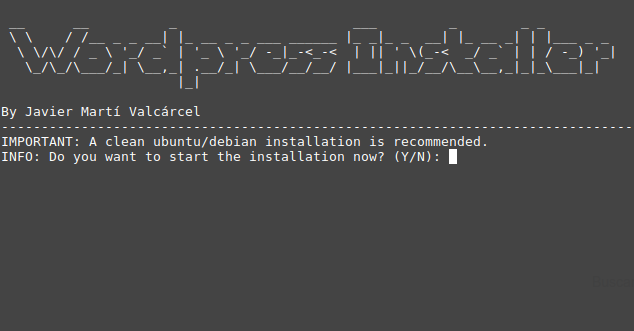

# Wordpress Autoinstaller
Full automatic Wordpress installer for Debian based systems. Fully built in Bash!
## Screenshots
--------------

## Features
--------------
- Fully built in bash.
- Just run and good to go.
- Automatically installs all dependecies such as Apache2 and MariaDB.
- Configures everything automatically , it even creates users and databases.
- Super easy to use!
## Installation and Use
--------------
Download from github's repository

` git clone https://github.com/undernightcore/wordpress-installer.git`

Run the installer (run as root)

` cd wordpress-installer `

` sudo bash wordpress-installer `
